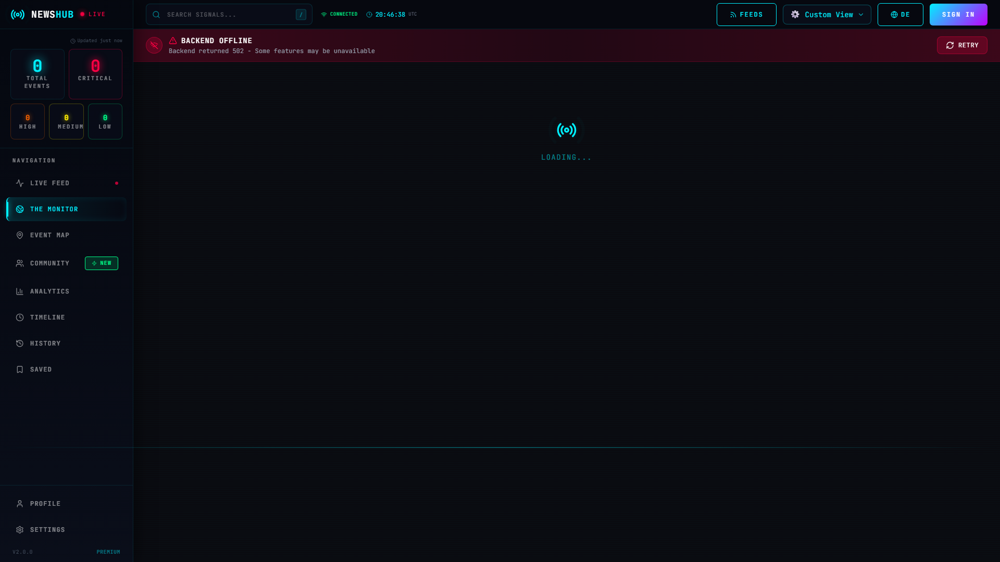
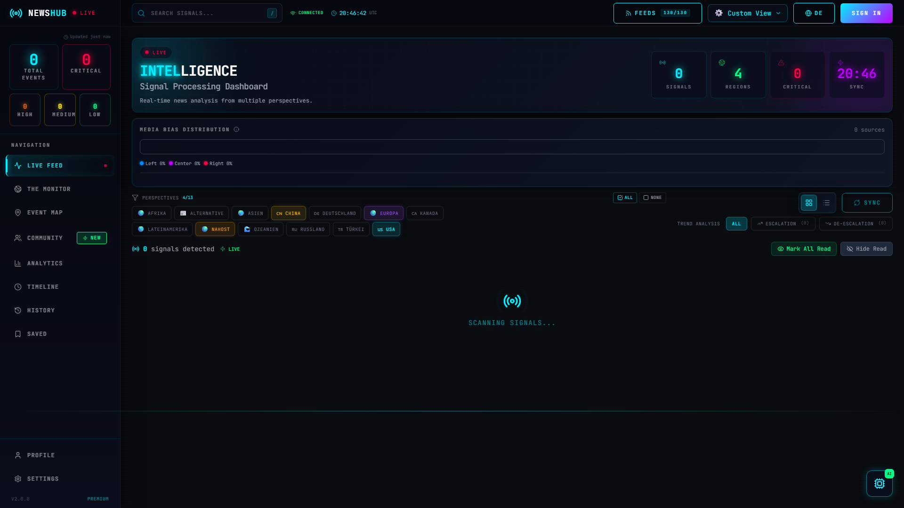

<div align="center">

# NewsHubitat

### Multi-Perspective Global News Intelligence Platform

[](https://www.typescriptlang.org/)
[](https://react.dev/)
[](https://vitejs.dev/)
[](https://expressjs.com/)
[](https://tailwindcss.com/)
[](https://www.prisma.io/)
[](https://opensource.org/licenses/MIT)
[](http://makeapullrequest.com)

**Break free from the filter bubble.**

Aggregate, analyze, and compare news from 130 sources across 13 global regions with AI-powered insights, real-time translation, and perspective comparison visualization.

[Features](#-features) · [Quick Start](#-quick-start) · [Documentation](#-documentation) · [API Reference](#-api-reference) · [Contributing](#-contributing)

</div>

---

## Table of Contents

- [The Problem](#-the-problem)
- [Features](#-features)
- [Demo](#-demo)
- [Quick Start](#-quick-start)
- [Documentation](#-documentation)
- [Architecture](#-architecture)
- [API Reference](#-api-reference)
- [Configuration](#%EF%B8%8F-configuration)
- [Tech Stack](#-tech-stack)
- [Testing](#-testing)
- [Roadmap](#-roadmap)
- [Contributing](#-contributing)
- [Security](#-security)
- [License](#-license)
- [Acknowledgments](#-acknowledgments)

---

## 🎯 The Problem

In today's fragmented media landscape, we're trapped in **filter bubbles**. Western readers rarely see how events are covered in Russia, China, or the Middle East — and vice versa.

**NewsHubitat** solves this by:

| Challenge | Solution |
|-----------|----------|
| Limited perspective | Aggregating from **130 international sources** across **13 regions** |
| Language barriers | **Real-time translation** to your preferred language |
| Hidden bias | **AI-powered bias detection** and framing analysis |
| Information overload | **Smart clustering** and topic summarization |

---

## ✨ Features

### 🗞️ Multi-Perspective News Feed

<table>
<tr>
<td width="50%">

**Signal Cards** display news as intelligence signals:
- Color-coded perspective badges by region
- Sentiment indicators (escalation/de-escalation)
- Source reliability scores (1-10)
- One-click translation
- Bookmark & share functionality

</td>
<td width="50%">

**Global Perspective Coverage**
- 🇺🇸 Western (USA, Europe)
- 🇸🇦 Middle East
- 🇹🇷 Turkish
- 🇷🇺 Russian
- 🇨🇳 Chinese
- 📡 Alternative Media

</td>
</tr>
</table>

### 🌍 The Monitor — Real-Time Geopolitical Tracking

| 3D Globe View | 2D Map View |
|---------------|-------------|
| Interactive WebGL globe with live event markers | Leaflet-based map with marker clustering |
| Hover for event details and source articles | Click to filter by severity level |
| Auto-rotation highlighting event hotspots | Heat map overlay for conflict density |

**Event Categories:** `Conflict` · `Humanitarian` · `Political` · `Economic` · `Military` · `Protest`

### 🤖 AI-Powered Analysis

```
┌──────────────────────────────────────────────────────────────────┐
│  CLUSTER ANALYSIS                                                │
│  ════════════════════════════════════════════════════════════════│
│                                                                  │
│  Topic: "Ukraine Conflict"                                       │
│  ┌─────────┐  ┌─────────┐  ┌─────────┐  ┌─────────┐             │
│  │ WESTERN │  │ RUSSIAN │  │ CHINESE │  │ TURKISH │             │
│  │   12    │  │    8    │  │    5    │  │    4    │             │
│  │articles │  │articles │  │articles │  │articles │             │
│  └─────────┘  └─────────┘  └─────────┘  └─────────┘             │
│                                                                  │
│  AI Summary: "Western sources emphasize humanitarian impact,     │
│  Russian sources focus on NATO expansion, Chinese coverage       │
│  highlights economic sanctions implications..."                  │
└──────────────────────────────────────────────────────────────────┘
```

- **Topic Clustering** — Automatically groups related articles across sources
- **Framing Comparison** — See how different regions frame the same story
- **Propaganda Detection** — AI analysis of rhetorical techniques
- **Coverage Gap Finder** — Discover stories underreported in your region

### 💬 Ask AI — RAG-Powered Q&A

Chat with an AI that has full context about current news:

> **You:** What are the different perspectives on the Taiwan situation?
>
> **AI:** Based on 47 recent articles: Western sources (23) emphasize defense commitments and democracy preservation, Chinese sources (15) focus on territorial integrity and the "One China" policy, while regional Asian sources (9) highlight economic and trade implications...

### 📊 Additional Features

| Feature | Description |
|---------|-------------|
| **Breaking News Ticker** | Real-time scrolling ticker with critical alerts |
| **Tension Index** | Global geopolitical tension score (0-100) |
| **Media Bias Bar** | Visual distribution of source political leanings |
| **Top Keywords** | Trending topics extracted via NLP |
| **Bookmarks** | Save articles with cloud sync |
| **Markets Panel** | Live financial data integration |
| **Timeline View** | Historical event exploration |
| **PWA Support** | Install as desktop/mobile app |
| **Offline Mode** | Read cached articles without internet |
| **Feed Manager** | Enable/disable sources, create custom feed presets |
| **Read Marking** | Mark articles as read, hide read articles |
| **Community** | Submit tips, fact-checks, translations; earn reputation |
| **Keyboard Shortcuts** | Full keyboard navigation (press `?` for help) |

### ⌨️ Keyboard Shortcuts

Navigate the app without touching your mouse:

| Key | Action |
|-----|--------|
| `1` - `6` | Navigate to Dashboard / Analysis / Monitor / Timeline / EventMap / Community |
| `/` | Focus search |
| `j` / `k` | Next / previous article |
| `o` | Open article in new tab |
| `b` | Bookmark article |
| `m` | Mark as read |
| `r` | Refresh data |
| `Escape` | Close modal or panel |
| `?` | Show all keyboard shortcuts |

---

## 🎬 Demo

### Screenshots

<details open>
<summary><strong>Dashboard — Multi-Perspective News Feed</strong></summary>


*Signal Cards with color-coded perspective badges, sentiment indicators, and source reliability scores.*

</details>

<details>
<summary><strong>Monitor — Real-Time Geopolitical Tracking</strong></summary>

| 3D Globe View | Event Details |
|---------------|---------------|
|  |  |

*Interactive WebGL globe with live event markers. Hover for details, click to filter by severity.*

</details>

<details>
<summary><strong>Analysis — AI-Powered Topic Clustering</strong></summary>


*Automatic topic clustering with perspective distribution. AI-generated summaries compare framing across regions.*

</details>

<details>
<summary><strong>Timeline — Historical Event Explorer</strong></summary>


*Chronological view of geopolitical events with category filtering and severity indicators.*

</details>

<details>
<summary><strong>Community — Contribution Hub</strong></summary>


*Submit tips, fact-checks, and translations. Earn badges and climb the leaderboard.*

</details>

<details>
<summary><strong>Feed Manager & Dark Theme</strong></summary>

| Feed Manager | Keyboard Shortcuts |
|--------------|-------------------|
|  |  |

*Control your sources, create custom feeds, and navigate with keyboard shortcuts.*

</details>

---

## 🚀 Quick Start

### Prerequisites

- **Node.js** 18.0 or higher
- **npm** 9.0 or higher
- At least one AI API key (Gemini recommended — it's free!)

### Installation

```bash
# Clone the repository
git clone https://github.com/ikarusXPS/NewsHubitat.git
cd NewsHubitat

# Install dependencies
npm install

# Set up environment variables
cp .env.example .env

# Initialize database
npx prisma generate
npx prisma db push
```

### Configure API Keys

Edit `.env` with your API keys:

```env
# Required: At least one AI provider
GEMINI_API_KEY=your_key_here        # FREE tier - 1500 requests/day (Recommended)
# OPENROUTER_API_KEY=your_key_here  # Paid - cheapest option
# ANTHROPIC_API_KEY=your_key_here   # Premium - Claude API

# Optional: Translation (improves experience)
DEEPL_API_KEY=your_key_here         # Best quality translations
```

<details>
<summary>📋 Where to get API keys</summary>

| Provider | Free Tier | Link |
|----------|-----------|------|
| **Google Gemini** | 1,500 requests/day | [Get API Key](https://makersuite.google.com/app/apikey) |
| **OpenRouter** | Pay-as-you-go | [Get API Key](https://openrouter.ai/keys) |
| **Anthropic** | Pay-as-you-go | [Get API Key](https://console.anthropic.com/) |
| **DeepL** | 500,000 chars/month | [Get API Key](https://www.deepl.com/pro-api) |

</details>

### Run Development Server

```bash
# Start both frontend and backend concurrently
npm run dev
```

Open your browser:
- **Frontend:** http://localhost:5173
- **Backend API:** http://localhost:3001
- **API Health Check:** http://localhost:3001/api/health

### Production Build

```bash
npm run build
npm start
```

---

## 📚 Documentation

### Project Structure

```
NewsHubitat/
├── src/                          # React Frontend
│   ├── components/               # 40+ UI components
│   │   ├── SignalCard.tsx        # News article display
│   │   ├── GlobeView.tsx         # 3D WebGL globe
│   │   ├── AskAI.tsx             # RAG chat interface
│   │   ├── feed-manager/         # Feed management modal
│   │   ├── community/            # Community contribution forms
│   │   └── ...
│   ├── pages/                    # Route pages
│   │   ├── Dashboard.tsx         # Main news feed
│   │   ├── Monitor.tsx           # Geopolitical tracking
│   │   ├── Analysis.tsx          # AI clustering
│   │   ├── Community.tsx         # Community hub
│   │   └── ...
│   ├── hooks/                    # Custom React hooks
│   │   └── useKeyboardShortcuts.ts
│   ├── store/                    # Zustand state management
│   ├── contexts/                 # React contexts (Auth)
│   └── types/                    # TypeScript definitions
│
├── server/                       # Express Backend
│   ├── routes/                   # API endpoints
│   │   ├── news.ts               # News CRUD operations
│   │   ├── ai.ts                 # AI analysis endpoints
│   │   ├── auth.ts               # Authentication
│   │   └── events.ts             # Geo events
│   ├── services/                 # Business logic
│   │   ├── newsAggregator.ts     # RSS/scraping orchestration
│   │   ├── aiService.ts          # Multi-provider AI
│   │   └── translationService.ts # Translation chain
│   └── config/
│       └── sources.ts            # 130 news source configs
│
├── prisma/                       # Database
│   └── schema.prisma             # SQLite schema
│
├── e2e/                          # Playwright E2E tests
└── public/                       # Static assets
```

### Data Flow

```
┌─────────────┐     ┌─────────────┐     ┌─────────────┐
│  RSS Feeds  │────▶│             │────▶│  Sentiment  │
└─────────────┘     │    News     │     │  Analysis   │
                    │  Aggregator │     └──────┬──────┘
┌─────────────┐     │             │            │
│    Web      │────▶│   (Dedup)   │            ▼
│  Scraper    │     │             │     ┌─────────────┐
└─────────────┘     └──────┬──────┘     │ Translation │
                           │            └──────┬──────┘
┌─────────────┐            │                   │
│  News APIs  │────────────┘                   ▼
│  (GNews)    │                         ┌─────────────┐
└─────────────┘                         │   SQLite    │
                                        │  Database   │
                                        └──────┬──────┘
                                               │
                                               ▼
                                        ┌─────────────┐
                                        │  React App  │
                                        │  (TanStack  │
                                        │   Query)    │
                                        └─────────────┘
```

---

## 📡 API Reference

### News Endpoints

| Endpoint | Method | Description |
|----------|--------|-------------|
| `/api/news` | `GET` | List articles with filters |
| `/api/news/:id` | `GET` | Get single article |
| `/api/news/:id/translate` | `POST` | Translate article content |
| `/api/news/sources` | `GET` | List all configured sources |
| `/api/news/sentiment` | `GET` | Sentiment statistics by region |

<details>
<summary>Query Parameters for <code>/api/news</code></summary>

```
?regions=usa,europe,russia    # Filter by region (comma-separated)
&search=climate               # Full-text search
&sentiment=negative           # Filter: positive | negative | neutral
&limit=50                     # Results per page (default: 20)
&offset=0                     # Pagination offset
```

</details>

### AI & Analysis Endpoints

| Endpoint | Method | Description |
|----------|--------|-------------|
| `/api/analysis/clusters` | `GET` | Get topic clusters |
| `/api/analysis/clusters?summaries=true` | `GET` | Clusters with AI summaries |
| `/api/analysis/framing` | `GET` | Framing comparison by topic |
| `/api/ai/ask` | `POST` | RAG-powered Q&A |

<details>
<summary>Example: Ask AI</summary>

```bash
curl -X POST http://localhost:3001/api/ai/ask \
  -H "Content-Type: application/json" \
  -d '{"question": "What are the main geopolitical topics today?"}'
```

</details>

### Events Endpoints

| Endpoint | Method | Description |
|----------|--------|-------------|
| `/api/events/geo` | `GET` | Geo-located events for map |
| `/api/events/timeline` | `GET` | Historical event timeline |

### Authentication Endpoints

| Endpoint | Method | Description |
|----------|--------|-------------|
| `/api/auth/register` | `POST` | Create new account |
| `/api/auth/login` | `POST` | Login (returns JWT) |
| `/api/auth/me` | `GET` | Get current user (requires Bearer token) |

---

## ⚙️ Configuration

### Environment Variables

```env
# Server
PORT=3001
DATABASE_URL="file:./dev.db"

# AI Providers (priority: Gemini → OpenRouter → Anthropic)
GEMINI_API_KEY=           # FREE tier - 1500 requests/day
OPENROUTER_API_KEY=       # Paid - cheapest multi-model access
ANTHROPIC_API_KEY=        # Premium - direct Claude API

# Translation (at least one recommended)
DEEPL_API_KEY=            # Best quality
GOOGLE_TRANSLATE_API_KEY= # Fallback option

# News APIs (optional - enables additional sources)
NEWSAPI_KEY=
GNEWS_API_KEY=
```

### Adding News Sources

Edit `server/config/sources.ts`:

```typescript
{
  id: 'my-source',
  name: 'My News Source',
  country: 'US',
  region: 'usa',  // usa | europe | germany | middle-east | turkey | russia | china | asia | africa | latam | oceania | canada | alternative
  language: 'en',
  bias: {
    political: 0,      // -1 (left) to +1 (right)
    reliability: 8,    // 1-10 scale
    ownership: 'private'
  },
  apiEndpoint: 'https://example.com/rss.xml',
  rateLimit: 100,
}
```

---

## 🛠 Tech Stack

### Frontend

| Technology | Version | Purpose |
|------------|---------|---------|
| [React](https://react.dev/) | 19.2 | UI Framework |
| [TypeScript](https://www.typescriptlang.org/) | 5.9 | Type Safety |
| [Vite](https://vitejs.dev/) | 7.3 | Build Tool & Dev Server |
| [Tailwind CSS](https://tailwindcss.com/) | 4.2 | Utility-First Styling |
| [Zustand](https://zustand-demo.pmnd.rs/) | 5.0 | State Management |
| [TanStack Query](https://tanstack.com/query) | 5.x | Server State & Caching |
| [Framer Motion](https://www.framer.com/motion/) | 12.x | Animations |
| [globe.gl](https://globe.gl/) | 2.x | 3D Globe Visualization |
| [Leaflet](https://leafletjs.com/) | 1.9 | 2D Maps |
| [Recharts](https://recharts.org/) | 3.x | Charts & Graphs |

### Backend

| Technology | Version | Purpose |
|------------|---------|---------|
| [Express](https://expressjs.com/) | 5.2 | API Server |
| [Prisma](https://www.prisma.io/) | 7.7 | Database ORM |
| [SQLite](https://www.sqlite.org/) | - | Database |
| [Puppeteer](https://pptr.dev/) | 24.x | Web Scraping |
| [rss-parser](https://github.com/rbren/rss-parser) | 3.x | RSS Feed Parsing |
| [Winston](https://github.com/winstonjs/winston) | 3.x | Logging |
| [Zod](https://zod.dev/) | 4.x | Schema Validation |
| [JWT](https://jwt.io/) | - | Authentication |

### AI & Translation

| Provider | Purpose |
|----------|---------|
| Google Gemini | Primary AI (free tier) |
| OpenRouter | Secondary AI (multi-model) |
| Anthropic Claude | Premium AI fallback |
| DeepL | Primary translation |
| Google Translate | Translation fallback |

---

## 🧪 Testing

### Unit Tests (Vitest)

```bash
npm run test              # Run all unit tests
npm run test:watch        # Watch mode
npm run test:coverage     # Generate coverage report
npm run test:ui           # Interactive UI
```

### E2E Tests (Playwright)

```bash
npm run test:e2e          # Run headless
npm run test:e2e:headed   # Run with browser visible
npm run test:e2e:ui       # Interactive UI mode
```

### Code Quality

```bash
npm run typecheck         # TypeScript validation
npm run lint              # ESLint validation
```

---

## 🗺 Roadmap

- [x] Multi-perspective news aggregation (130 sources)
- [x] Real-time translation
- [x] AI-powered analysis
- [x] 3D Globe & 2D Map visualization
- [x] SQLite/Prisma database integration
- [x] PWA support
- [x] PostgreSQL migration for production
- [x] Redis caching layer
- [x] Real-time WebSocket updates
- [x] Email digest feature
- [x] Customizable AI personas (8 built-in personas)
- [x] Social sharing features
- [x] Feed Manager with source control
- [x] Read marking and article tracking
- [x] Community contributions (tips, fact-checks, translations)
- [x] Keyboard shortcuts navigation
- [ ] Mobile app (React Native)
- [ ] Browser extension

---

## 🤝 Contributing

Contributions are welcome and appreciated! Here's how you can help:

### Getting Started

1. **Fork** the repository
2. **Clone** your fork: `git clone https://github.com/YOUR_USERNAME/NewsHubitat.git`
3. **Create** a feature branch: `git checkout -b feature/amazing-feature`
4. **Make** your changes
5. **Test** your changes: `npm run test && npm run lint`
6. **Commit** using conventional commits: `git commit -m 'feat: add amazing feature'`
7. **Push** to your branch: `git push origin feature/amazing-feature`
8. **Open** a Pull Request

### Commit Convention

We use [Conventional Commits](https://www.conventionalcommits.org/):

- `feat:` New feature
- `fix:` Bug fix
- `docs:` Documentation
- `style:` Formatting (no code change)
- `refactor:` Code restructuring
- `test:` Adding tests
- `chore:` Maintenance

### Code Style

- Follow existing code patterns
- Use TypeScript strict mode
- Write meaningful commit messages
- Add tests for new features
- Update documentation as needed

---

## 🔒 Security

### Reporting Vulnerabilities

If you discover a security vulnerability, please **do not** open a public issue. Instead:

1. Email the maintainers directly
2. Include detailed steps to reproduce
3. Allow time for a fix before public disclosure

### Security Features

- JWT-based authentication
- Input validation with Zod schemas
- SQL injection prevention via Prisma ORM
- XSS protection
- Rate limiting on API endpoints
- CORS configuration
- Secure headers

---

## 📄 License

This project is licensed under the **MIT License** — see the [LICENSE](LICENSE) file for details.

---

## 🙏 Acknowledgments

- News sources worldwide for providing RSS feeds
- [Google Gemini](https://deepmind.google/technologies/gemini/) for free AI API access
- [DeepL](https://www.deepl.com/) for translation services
- [globe.gl](https://globe.gl/) for the stunning 3D globe
- The open-source community for amazing tools and libraries

---

## 📊 Supported Regions & Sources

<details>
<summary>Click to expand full source list</summary>

| Region | Example Sources | Languages |
|--------|-----------------|-----------|
| **USA** | AP, Reuters, CNN, NYT, WSJ, Fox, NPR, Politico, Bloomberg, WaPo | EN |
| **Europe** | BBC, Guardian, DW, France24, Euronews, El País, Corriere, NOS | EN, DE, FR, ES, IT, NL |
| **Germany** | Spiegel, Zeit, FAZ, Süddeutsche, Tagesschau, Handelsblatt, Welt | DE |
| **Middle East** | Al Jazeera, Al Arabiya, Middle East Eye, Times of Israel | AR, EN, HE, FA |
| **Turkey** | TRT, Hürriyet, Daily Sabah, Anadolu, Cumhuriyet | TR, EN |
| **Russia** | RT, TASS, Sputnik, Interfax, Novaya Gazeta | RU, EN |
| **China** | Xinhua, CGTN, Global Times, SCMP, Caixin | ZH, EN |
| **Asia** | NHK, Yomiuri, Korea Times, Straits Times, Times of India | Multiple |
| **Africa** | News24, Daily Nation, Egyptian Gazette, Punch Nigeria | EN, FR, AR |
| **Latin America** | Globo, Clarín, El Universal, La Nación, Telesur | ES, PT |
| **Oceania** | ABC Australia, Sydney Morning Herald, NZ Herald | EN |
| **Canada** | CBC, Globe and Mail, National Post, Toronto Star | EN, FR |
| **Alternative** | Intercept, Democracy Now, Consortium News, Common Dreams | EN |

</details>

---

<div align="center">

**Built with curiosity about the world's perspectives.**

*Break the bubble. See the bigger picture.*

<!-- CI/CD Pipeline: Automated testing and deployment via GitHub Actions -->

[](https://github.com/ikarusXPS/NewsHubitat)

</div>
