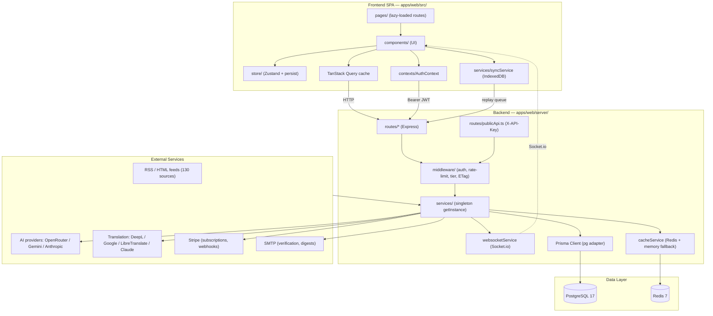
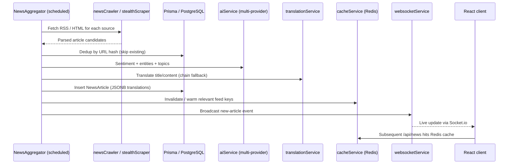

<!-- generated-by: gsd-doc-writer -->
# Architecture

## System Overview

NewsHub is a multi-perspective global news aggregation and analysis platform built as a full-stack TypeScript application in a **pnpm monorepo**. The system ingests news from 130 sources across 13 regions, performs sentiment analysis and translation, clusters related stories, and delivers personalized news feeds via a real-time dashboard. The architecture follows a **client-server pattern**: a React 19 SPA frontend consumes a RESTful Express 5 backend, with Socket.io for real-time updates and a public REST API gated by API keys. The backend runs in two boot modes (`RUN_HTTP` for request-serving replicas, `RUN_JOBS` for background-job replicas) so the topology can scale horizontally without duplicating scheduled work.

## Component Diagram



## Data Flow

### News ingestion pipeline

The aggregation worker (any replica with `RUN_JOBS=true`) drives the canonical RSS → DB pipeline:



### Request lifecycle

1. **Frontend request** — A page component issues a TanStack Query against `/api/...`; the request includes the JWT from `AuthContext` (read from `localStorage`) when authenticated.
2. **Middleware chain** — Express runs CORS → compression → server-timing → metrics → query counter → `authMiddleware` (JWT verify + Redis blacklist check) → tiered `rateLimiter` → ETag.
3. **Subscription gate (premium routes)** — `requireTier(tier)` (hard gate) or `attachUserTier` (soft) consults `subscriptionService` with a 5-minute cached status; AI endpoints additionally pass through `aiTierLimiter` for FREE-tier 24h sliding-window quotas.
4. **Service layer** — Route handlers delegate to a singleton service (`NewsAggregator`, `AIService`, etc.); services share one `PrismaClient` and read/write `cacheService` (Redis with in-memory fallback).
5. **Response** — JSON shaped as `ApiResponse<T>` with `success / data / error / meta`; `RateLimit-*` headers and `Server-Timing` are emitted by middleware.
6. **Real-time push** — When backend state changes (new article, comment, team event), `WebSocketService` emits to subscribed clients; `useEventSocket` / `usePersonalization` hooks react in the UI.
7. **Offline path** — When the browser is offline, mutating actions are queued in IndexedDB by `services/syncService.ts` and replayed once the network returns.

## Key Abstractions

| Abstraction | Purpose | File Location |
|---|---|---|
| **NewsAggregator** | Orchestrates RSS fetching, dedup, AI/translation enrichment, and persistence; runs only when `RUN_JOBS=true` | `apps/web/server/services/newsAggregator.ts` |
| **AIService** | Multi-provider chat/completion with fallback chain (OpenRouter → Gemini → Anthropic → keyword heuristic) | `apps/web/server/services/aiService.ts` |
| **TranslationService** | Multi-provider translation chain (DeepL → Google → LibreTranslate → Claude) | `apps/web/server/services/translationService.ts` |
| **CacheService** | Redis wrapper with in-memory fallback; hosts JWT blacklist, rate-limit counters, AI/subscription/feed caches | `apps/web/server/services/cacheService.ts` |
| **WebSocketService** | Socket.io server for live article, event, comment, and team broadcasts | `apps/web/server/services/websocketService.ts` |
| **CleanupService** | Daily background jobs: unverified accounts (30d), share-click analytics (90d) | `apps/web/server/services/cleanupService.ts` |
| **SubscriptionService** | Stripe subscription state, tier resolution, 5-min status cache, grace-period logic | `apps/web/server/services/subscriptionService.ts` |
| **TeamService / CommentService** | Team collaboration and threaded article comments | `apps/web/server/services/teamService.ts`, `commentService.ts` |
| **ApiKeyService** | Issues / hashes / verifies `nh_{env}_{random}_{checksum}` keys; checksum pre-validation + bcrypt | `apps/web/server/services/apiKeyService.ts` |
| **runBootLifecycle** | Boot-mode dispatcher; decides which services + jobs are constructed based on `RUN_HTTP` / `RUN_JOBS` | `apps/web/server/bootLifecycle.ts` |
| **useAppStore** | Zustand store (theme, language, filters, bookmarks, reading history, feed settings, personalization) persisted as `newshub-storage` | `apps/web/src/store/index.ts` |
| **AuthContext / ConsentContext** | React Context providers for JWT session and GDPR consent categories | `apps/web/src/contexts/AuthContext.tsx`, `ConsentContext.tsx` |
| **syncService** | Client-side offline action queue stored in IndexedDB; replays on reconnect | `apps/web/src/services/syncService.ts` |
| **OpenAPI generator** | Code-first OpenAPI spec built from Zod schemas via `@asteasolutions/zod-to-openapi` | `apps/web/server/openapi/generator.ts`, `schemas.ts` |
| **ApiResponse&lt;T&gt;** | Standard envelope `{ success, data?, error?, meta? }` shared via `@newshub/types` | `packages/types/index.ts` |

## Multi-Provider Patterns

Both the AI and translation pipelines are designed for **graceful degradation** — every external dependency has at least one fallback so a key/quota failure never takes down the feature.

- **AI fallback chain** (`aiService.ts`)
  1. **OpenRouter** (free models) — primary
  2. **Gemini** (1500 req/day free) — secondary
  3. **Anthropic** — premium fallback
  4. **Keyword-based heuristic** — last-resort, always available
- **Translation fallback chain** (`translationService.ts`)
  1. **DeepL** — primary, highest quality
  2. **Google Translate** — secondary
  3. **LibreTranslate** — open-source fallback
  4. **Claude (Anthropic)** — final fallback
- **Result envelope** — Every provider call records which provider answered so callers and metrics can attribute cost/latency.
- **Health-aware skipping** — Providers that 4xx/5xx are temporarily skipped to avoid wasting latency on broken keys.

## Caching Strategy

`cacheService.ts` is the single Redis seam. It is used as:

| Use case | Key prefix / scope | TTL |
|---|---|---|
| JWT blacklist (logout, token-version bump) | `jwt:blacklist:*` | 7 days |
| Tiered rate limits (auth / AI / news) | `ratelimit:*` | window-based (1 min — 24 h) |
| API-key validation cache (first 15 chars only) | `apikey:*` | 5 min |
| AI response cache | `ai:*` | configurable |
| Subscription status | `sub:status:*` | 5 min |
| Stripe webhook idempotency | `stripe:webhook:*` (mirrored to DB) | 24 h |

**Graceful degradation:** if Redis is unreachable, the service transparently falls back to an in-process Map so the application keeps serving requests. Caches are never authoritative for security-sensitive data — JWT blacklist and webhook idempotency are dual-stored in PostgreSQL.

## Database

- **Engine:** PostgreSQL 17 (per `docker-compose.yml`)
- **Client:** Prisma 7 with the `@prisma/adapter-pg` driver adapter; generated client emitted to `apps/web/src/generated/prisma/` (do not edit)
- **Schema:** `apps/web/prisma/schema.prisma`. Models in current schema:

  | Group | Models |
  |---|---|
  | Core | `NewsArticle`, `NewsSource`, `User`, `Bookmark`, `ReadingHistory`, `StoryCluster` |
  | Email & personas | `EmailSubscription`, `EmailDigest`, `AIPersona`, `UserPersona` |
  | Social / sharing | `SharedContent`, `ShareClick`, `Comment` |
  | Gamification | `Badge`, `UserBadge`, `LeaderboardSnapshot` |
  | Teams | `Team`, `TeamMember`, `TeamBookmark`, `TeamInvite` |
  | Public API & billing | `ApiKey`, `ProcessedWebhookEvent` |
  | Growth | `ReferralReward`, `Campaign`, `StudentVerification` |

- **JSONB columns** are used for translations (`titleTranslated`, `contentTranslated`) and entity arrays; GIN indexes accelerate topic / entity search.
- **Migrations** live in `apps/web/prisma/migrations/`; `pnpm seed` populates badges, AI personas, and (optionally) load-test users.

## Real-time

`WebSocketService` (`server/services/websocketService.ts`) is a Socket.io server attached to the same HTTP listener as Express. It is initialized only when `RUN_HTTP=true`. Channels:

- **Articles** — broadcasts when a new article is persisted (driven by `NewsAggregator`).
- **Events** — geo-event updates consumed by `Monitor.tsx` and `EventMap.tsx` (which share the `['geo-events']` query key).
- **Comments / Teams** — incremental updates for live collaboration views.

In multi-replica deployments, the aggregation worker uses a Redis Pub/Sub channel (`server/jobs/workerEmitter.ts`) to fan messages out to every web replica before they are emitted via Socket.io.

## Public API & OpenAPI

External developers consume `apps/web/server/routes/publicApi.ts`, gated by API keys.

- **Spec source of truth:** Zod schemas in `apps/web/server/openapi/schemas.ts` are used for **runtime validation AND OpenAPI generation** via `@asteasolutions/zod-to-openapi`.
- **Generation:** `pnpm openapi:generate` writes `apps/web/public/openapi.json`.
- **Docs UI:** Scalar at `/api-docs`; spec served from `/openapi.json`.
- **Auth:** `X-API-Key` header (security scheme in the spec) handled by `middleware/apiKeyAuth.ts`; rate limits applied by `middleware/apiKeyRateLimiter.ts` using the API-key ID (NAT/VPN friendly), with IETF `RateLimit-*` response headers.
- **Limits:** Max 3 active keys per user; checksum pre-validation rejects malformed keys before any DB lookup.

## Subscription Tier Middleware

Stripe-backed tiers (`FREE` / `PREMIUM` / `ENTERPRISE`) are enforced through three composable middleware in `apps/web/server/middleware/`:

- **`requireTier(tier)`** — hard gate; returns 403 with `upgradeUrl` for `CANCELED` / `PAUSED` subscriptions.
- **`attachUserTier`** — soft attach without blocking; allows tier-aware UI and conditional features.
- **`aiTierLimiter`** — 24-hour sliding window enforcing the FREE-tier 10-AI-queries/day cap (lives in `middleware/rateLimiter.ts`).

**Webhook ordering invariant:** the Stripe webhook router (`server/routes/webhooks/stripe.ts`) is mounted **before** `express.json()` so the raw body is preserved for HMAC signature verification. Idempotency uses dual storage (Redis + `ProcessedWebhookEvent` table) with a 24h window.

## Directory Structure Rationale

### Monorepo root

```
NewsHub/
├── apps/web/                # The application (frontend + backend + Prisma + e2e)
├── packages/types/          # @newshub/types — shared TypeScript types
├── pnpm-workspace.yaml
├── docker-compose.yml       # postgres:17, redis:7.4, app, prometheus, grafana, alertmanager
└── package.json             # Root scripts proxy to apps/web
```

The single-app monorepo lets the frontend, backend, and shared types be type-checked and built together while keeping a clean import boundary (`@newshub/types`).

### Frontend (`apps/web/src/`)

- **`pages/`** — Route-level components, all lazy-loaded via `lazyWithRetry` in `routes.ts` (Dashboard, Analysis, Timeline, MapView, Globe, Monitor, EventMap, Community, Profile, Settings, Bookmarks, ReadingHistory, Pricing, DevelopersPage, TeamDashboard, ...). Code-splitting keeps the initial bundle inside the 250 KB CI budget.
- **`components/`** — Reusable UI organized by feature. Large feature areas have subdirectories (e.g., `community/`, `monitor/`, `feed-manager/`).
- **`store/`** — Single Zustand store with `persist` middleware writing `newshub-storage` to localStorage; covers theme, language, filters, bookmarks, reading history, feed settings, personalization, and consent.
- **`hooks/`** — Custom hooks (`useEventSocket`, `useCachedQuery`, `useKeyboardShortcuts`, `useShare`, `useTeams`, `usePersonalization`, ...).
- **`contexts/`** — `AuthContext` (JWT session) and `ConsentContext` (GDPR categories: essential / preferences / analytics).
- **`services/`** — Client-side `cacheService` (browser cache helpers) and `syncService` (IndexedDB offline queue).
- **`i18n/`** — `react-i18next` + `i18next-icu`; locales for DE / EN / FR.
- **`generated/prisma/`** — Generated Prisma client (do not edit).
- **`routes.ts`** — Single source of truth for lazy-loaded route components.
- **`instrument.ts`** — Sentry browser SDK initialization.

### Backend (`apps/web/server/`)

- **`index.ts`** — Express app construction, middleware ordering, route mounting, and `runBootLifecycle` invocation.
- **`bootLifecycle.ts`** — Boot-mode dispatcher gated on `RUN_HTTP` / `RUN_JOBS`; ensures jobs only initialize on the worker replica.
- **`routes/`** — One router per feature (news, auth, oauth, ai, analysis, events, focus, personas, sharing, email, profile, badges, leaderboard, account, bookmarks, history, comments, teams, subscriptions, publicApi, apiKeys, markets, translation, webhooks/stripe).
- **`services/`** — Singleton business logic via `getInstance()`. All services share a single `PrismaClient` from `db/prisma.ts`.
- **`middleware/`** — `rateLimiter`, `apiKeyAuth`, `apiKeyRateLimiter`, `requireTier`, `serverTiming`, `metricsMiddleware`, `etagMiddleware`, `queryCounter`, `botDetection`, `teamAuth`, `shutdown`.
- **`openapi/`** — `schemas.ts` (Zod source of truth) and `generator.ts` (Zod → OpenAPI emit).
- **`config/`** — `sources.ts` (130 RSS sources with bias metadata), AI provider configuration, Passport OAuth config.
- **`jobs/`** — Background-worker emitters (e.g., `workerEmitter.ts` for Redis Pub/Sub fan-out).
- **`db/`** — Prisma client wrapper with pool stats and health checks.
- **`utils/`** — Logger, hashing, DB logging, etc.
- **`__tests__/`** — Backend integration / contract tests (per-service unit tests live next to their service as `*.test.ts`).

### Shared types (`packages/types/`)

Single `index.ts` exporting domain types (`PerspectiveRegion`, `NewsArticle`, `Sentiment`, `EventSeverity`, `ApiResponse<T>`, ...). Imported as:

```typescript
import type { PerspectiveRegion, NewsArticle, ApiResponse } from '@newshub/types';
```

### Infrastructure

- **`docker-compose.yml`** — `app`, `postgres:17`, `redis:7.4-alpine`, `prom/prometheus:v3.4.0`, `prom/alertmanager:v0.28.1`, `grafana/grafana-oss:13.0.1`.
- **`prometheus/`** — Scrape config targeting the backend `/api/metrics` endpoint.
- **`grafana/`** — Dashboards for request latency, DB performance, cache hit rate, and queue depth.
- **`.github/workflows/`** — `ci.yml` (lint → typecheck → unit tests with 80% coverage gate → build → Lighthouse on master), `load-test.yml` (k6 via `workflow_dispatch` against `STAGING_URL`).
- **`apps/web/e2e/`** — Playwright projects split into `setup`, unauthenticated `chromium`, and authenticated `chromium-auth` (uses persisted storage state).
