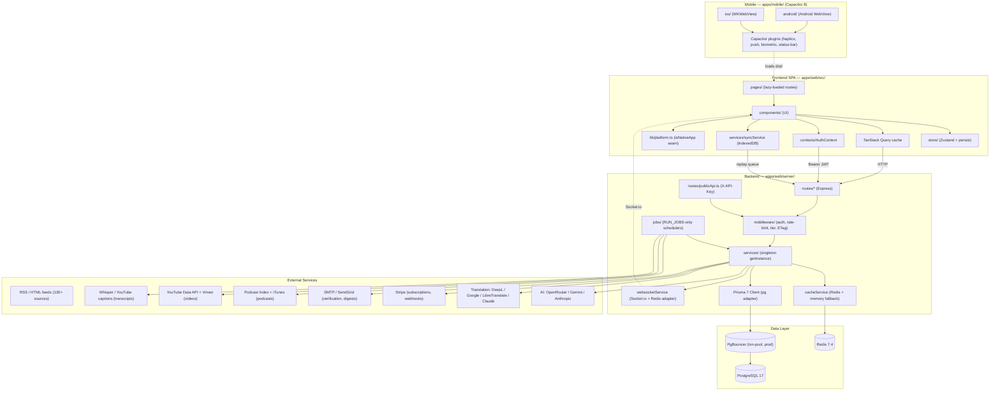
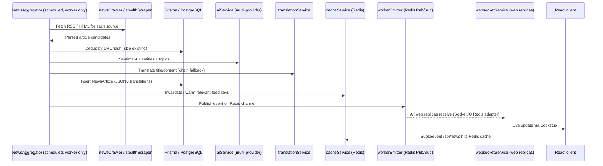

<!-- generated-by: gsd-doc-writer -->
# Architecture

## System Overview

NewsHub is a multi-perspective global news aggregation and analysis platform built as a full-stack TypeScript application in a **pnpm monorepo**. The system ingests news from 130+ sources across 17 regions, performs sentiment analysis and translation, clusters related stories, surfaces credibility/bias signals + AI fact-checking, and delivers personalized news feeds with related podcast and video content via a real-time dashboard. The architecture follows a **client-server pattern**: a React 19 SPA frontend (also wrapped as iOS + Android via Capacitor 8) consumes a RESTful Express 5 backend, with Socket.io for real-time updates and a public REST API gated by API keys. The backend runs in two boot modes (`RUN_HTTP` for request-serving replicas, `RUN_JOBS` for the background-job worker) so the topology can scale horizontally without duplicating scheduled work.

## Component Diagram



## Data Flow

### News ingestion pipeline

The aggregation worker (the singleton replica with `RUN_JOBS=true`) drives the canonical RSS → DB pipeline:



In production, the worker never holds a Socket.io HTTP server itself — it publishes to a Redis Pub/Sub channel and every web replica's Socket.io adapter fans the event out to its connected clients. This is what `pnpm test:fanout` (in `e2e-stack/`) verifies end-to-end.

### Request lifecycle

1. **Frontend request** — A page component issues a TanStack Query against `/api/...`; the request includes the JWT from `AuthContext` (read from `localStorage`) when authenticated.
2. **Middleware chain** — Express runs CORS → compression → server-timing → ETag → metrics → query counter → Passport (stateless) → (Stripe webhook router, raw body, MUST be before `express.json()`) → `express.json()` (preserves `req.rawBody`) → per-route `authMiddleware` (JWT verify + Redis blacklist) → tiered rate limiters.
3. **Subscription gate (premium routes)** — `requireTier(tier)` (hard gate) or `attachUserTier` (soft) consults `subscriptionService` with a 5-minute cached status; AI endpoints additionally pass through `aiTierLimiter` for FREE-tier 24h sliding-window quotas (`/api/ai`, `/api/analysis`).
4. **Service layer** — Route handlers delegate to a singleton service (`NewsAggregator`, `AIService`, etc.); services share one `PrismaClient` from `db/prisma.ts` and read/write `cacheService` (Redis with in-memory fallback).
5. **Response** — JSON shaped as `ApiResponse<T>` with `success / data / error / meta`; `RateLimit-*` headers and `Server-Timing` are emitted by middleware.
6. **Real-time push** — When backend state changes (new article, comment, team event), `WebSocketService` emits to subscribed clients on its replica; in multi-replica deployments the Socket.IO Redis adapter ensures clients on every replica receive the event regardless of which replica originated it.
7. **Offline path** — When the browser is offline, mutating actions are queued in IndexedDB by `services/syncService.ts` and replayed once the network returns. The PWA service worker (`vite-plugin-pwa`) supplies the offline app shell; on iOS / Android the same service worker is shipped inside the Capacitor wrapper.

## Key Abstractions

| Abstraction | Purpose | File Location |
|---|---|---|
| **NewsAggregator** | Orchestrates RSS fetching, dedup, AI/translation enrichment, and persistence; constructed only when `RUN_JOBS=true` | `apps/web/server/services/newsAggregator.ts` |
| **newsReadService** | Read-side Prisma + Redis cache used by web replicas (no in-memory state) | `apps/web/server/services/newsReadService.ts` |
| **AIService** | Multi-provider chat/completion with fallback chain (OpenRouter → Gemini → Anthropic → keyword heuristic); also hosts credibility/factCheck/framing prompts | `apps/web/server/services/aiService.ts` |
| **CredibilityService / FactCheckReadService** | Deterministic credibility scoring + Postgres FTS-backed fact-check lookups (Phase 38) | `apps/web/server/services/credibilityService.ts`, `factCheckReadService.ts` |
| **TranslationService** | Multi-provider translation chain (DeepL → Google → LibreTranslate → Claude) | `apps/web/server/services/translationService.ts` |
| **CacheService** | Redis wrapper with in-memory fallback; hosts JWT blacklist, rate-limit counters, AI/subscription/feed/podcast/video caches | `apps/web/server/services/cacheService.ts` |
| **WebSocketService** | Socket.io server with `@socket.io/redis-adapter` for cross-replica fanout | `apps/web/server/services/websocketService.ts` |
| **workerEmitter** | Worker-only Redis Pub/Sub publisher consumed by every web replica's Socket.IO adapter | `apps/web/server/jobs/workerEmitter.ts` |
| **CleanupService** | Daily background jobs: unverified accounts (30d), share-click analytics (90d) | `apps/web/server/services/cleanupService.ts` |
| **SubscriptionService** | Stripe subscription state, tier resolution, 5-min status cache, grace-period logic | `apps/web/server/services/subscriptionService.ts` |
| **StripeWebhookService** | Idempotent webhook handlers; dual-storage (Redis + `ProcessedWebhookEvent`) | `apps/web/server/services/stripeWebhookService.ts` |
| **PodcastService / PodcastIndexService / PodcastMatcherService / itunesPodcastService** | Phase 40 podcast aggregation + topic matching | `apps/web/server/services/podcast*.ts`, `itunesPodcastService.ts` |
| **VideoIndexService / YouTubeService** | Phase 40 video discovery + YouTube quota gating | `apps/web/server/services/videoIndexService.ts`, `youtubeService.ts` |
| **TranscriptService / WhisperService / YouTubeCaptionService** | Phase 40 Premium-gated transcripts (Whisper + ffmpeg chunking + YouTube captions) | `apps/web/server/services/transcriptService.ts`, `whisperService.ts`, `youtubeCaptionService.ts` |
| **TeamService / CommentService** | Team collaboration and threaded article comments | `apps/web/server/services/teamService.ts`, `commentService.ts` |
| **ApiKeyService** | Issues / hashes / verifies `nh_{env}_{random}_{checksum}` keys; checksum pre-validation + bcrypt | `apps/web/server/services/apiKeyService.ts` |
| **runBootLifecycle** | Boot-mode dispatcher; decides which services + jobs are constructed based on `RUN_HTTP` / `RUN_JOBS` | `apps/web/server/bootLifecycle.ts` |
| **registerShutdown** | `@godaddy/terminus` graceful drain — flips `/readiness` to 503 on SIGTERM, drains Socket.IO, closes Prisma pool | `apps/web/server/middleware/shutdown.ts` |
| **useAppStore** | Zustand store (theme, language, filters, bookmarks, reading history, feed settings, personalization) persisted as `newshub-storage` | `apps/web/src/store/index.ts` |
| **AuthContext / ConsentContext** | React Context providers for JWT session and GDPR consent categories | `apps/web/src/contexts/AuthContext.tsx`, `ConsentContext.tsx` |
| **isNativeApp** | Single platform-detection seam used by every Premium-gate UI to honor the iOS/Android reader-app exemption | `apps/web/src/lib/platform.ts` |
| **syncService** | Client-side offline action queue stored in IndexedDB; replays on reconnect | `apps/web/src/services/syncService.ts` |
| **OpenAPI generator** | Code-first OpenAPI spec built from Zod schemas via `@asteasolutions/zod-to-openapi` | `apps/web/server/openapi/generator.ts`, `schemas.ts` |
| **ApiResponse&lt;T&gt;** | Standard envelope `{ success, data?, error?, meta? }` shared via `@newshub/types` | `packages/types/index.ts` |

## Multi-Provider Patterns

Both the AI and translation pipelines are designed for **graceful degradation** — every external dependency has at least one fallback so a key/quota failure never takes down the feature.

- **AI fallback chain** (`aiService.ts`)
  1. **OpenRouter** (free models) — primary
  2. **Gemini** (1500 req/day free) — secondary
  3. **Anthropic** — premium fallback
  4. **Keyword-based heuristic** — last-resort, always available
- **Translation fallback chain** (`translationService.ts`)
  1. **DeepL** — primary, highest quality
  2. **Google Translate** — secondary
  3. **LibreTranslate** — open-source fallback
  4. **Claude (Anthropic)** — final fallback
- **Result envelope** — Every provider call records which provider answered so callers and metrics can attribute cost/latency.
- **Health-aware skipping** — Providers that 4xx/5xx are temporarily skipped to avoid wasting latency on broken keys.

## Caching Strategy

`cacheService.ts` is the single Redis seam. It is used as:

| Use case | Key prefix / scope | TTL |
|---|---|---|
| JWT blacklist (logout, token-version bump) | `jwt:blacklist:*` | 7 days |
| Tiered rate limits (auth / AI / news) | `ratelimit:*` | window-based (1 min — 24 h) |
| API-key validation cache (first 15 chars only) | `apikey:*` | 5 min |
| AI / credibility / fact-check response cache | `ai:*`, `credibility:*`, `factcheck:*` | 24 h (Phase 38) |
| Subscription status | `sub:status:*` | 5 min |
| Stripe webhook idempotency | `stripe:webhook:*` (mirrored to DB) | 24 h |
| Podcast / video feeds | `podcast:*`, `video:*` | configurable |

**Graceful degradation:** if Redis is unreachable, the service transparently falls back to an in-process Map so the application keeps serving requests. Caches are never authoritative for security-sensitive data — JWT blacklist and webhook idempotency are dual-stored in PostgreSQL.

## Database

- **Engine:** PostgreSQL 17 (per `docker-compose.yml`); production uses **PgBouncer 1.23.1 in transaction mode** in front of Postgres (`stack.yml`)
- **Client:** Prisma 7 with the `@prisma/adapter-pg` driver adapter; generated client emitted to `apps/web/src/generated/prisma/` (do not edit)
- **Workspace-local config:** `apps/web/prisma.config.ts` (Prisma 7 resolves `schema:` relative to the config file's directory — a root-level config silently loads a stale schema, see anti-patterns in `CLAUDE.md`)
- **Pooling:** Prisma `max:20` × 4 web replicas → PgBouncer `default_pool_size=25` → Postgres `max_connections=200` (leaves slack for migrations/ops)
- **Dual URLs:** runtime queries via `DATABASE_URL` (with `?pgbouncer=true` to disable prepared-statement caching); migrations via `DIRECT_URL` that bypasses PgBouncer
- **Schema:** `apps/web/prisma/schema.prisma` (30 models). Models in current schema:

  | Group | Models |
  |---|---|
  | Core | `NewsArticle`, `NewsSource`, `User`, `Bookmark`, `ReadingHistory`, `StoryCluster` |
  | Email & personas | `EmailSubscription`, `EmailDigest`, `AIPersona`, `UserPersona` |
  | Social / sharing | `SharedContent`, `ShareClick`, `Comment` |
  | Gamification | `Badge`, `UserBadge`, `LeaderboardSnapshot` |
  | Teams | `Team`, `TeamMember`, `TeamBookmark`, `TeamInvite` |
  | Public API & billing | `ApiKey`, `ProcessedWebhookEvent` |
  | Growth | `ReferralReward`, `Campaign`, `StudentVerification` |
  | AI signals (Phase 38) | `FactCheck` (with tsvector FTS + GIN index) |
  | Content (Phase 40) | `Podcast`, `PodcastEpisode`, `Video`, `Transcript` |
  | Enums | `SubscriptionTier`, `SubscriptionStatus`, `ApiKeyTier`, `ApiKeyEnv` |

- **JSONB columns** are used for translations (`titleTranslated`, `contentTranslated`) and entity arrays; GIN indexes accelerate topic / entity / fact-check search.
- **Migrations** live in `apps/web/prisma/migrations/`; `pnpm seed` populates badges, AI personas, and (optionally) load-test users.

## Real-time

`WebSocketService` (`server/services/websocketService.ts`) is a Socket.io server attached to the same HTTP listener as Express. It is initialized only when `RUN_HTTP=true` and uses `@socket.io/redis-adapter` so events broadcast on any replica reach clients connected to every other replica. Channels:

- **Articles** — broadcasts when a new article is persisted (driven by `NewsAggregator` running on the worker; web replicas receive via the Redis adapter).
- **Events** — geo-event updates consumed by `Monitor.tsx` and `EventMap.tsx` (which share the `['geo-events']` query key).
- **Comments / Teams** — incremental updates for live collaboration views.
- **Test-only fanout trigger** — `routes/_testEmit.ts` is mounted at `/api/_test` only when `NODE_ENV=test` (used by `e2e-stack/` to verify cross-replica delivery; never mounted in production).

In production, the aggregation worker has no Socket.io listener of its own — it publishes to Redis via `jobs/workerEmitter.ts`, and every web replica's adapter fans the event out. Verified by `pnpm test:fanout` (boots 2× app behind Traefik via `e2e-stack/docker-compose.test.yml` and asserts cross-replica delivery — runtime gate WS-04).

## Public API & OpenAPI

External developers consume `apps/web/server/routes/publicApi.ts`, gated by API keys.

- **Spec source of truth:** Zod schemas in `apps/web/server/openapi/schemas.ts` are used for **runtime validation AND OpenAPI generation** via `@asteasolutions/zod-to-openapi`.
- **Generation:** `pnpm openapi:generate` writes `apps/web/public/openapi.json`.
- **Docs UI:** Scalar at `/developers`; spec served from `/api/openapi.json`.
- **Auth:** `X-API-Key` header (security scheme in the spec) handled by `middleware/apiKeyAuth.ts`; rate limits applied by `middleware/apiKeyRateLimiter.ts` using the API-key ID (NAT/VPN friendly), with IETF `RateLimit-*` response headers.
- **Limits:** Max 3 active keys per user; checksum pre-validation rejects malformed keys before any DB lookup.

## Subscription Tier Middleware

Stripe-backed tiers (`FREE` / `PREMIUM` / `ENTERPRISE`) are enforced through three composable middleware in `apps/web/server/middleware/`:

- **`requireTier(tier)`** — hard gate; returns 403 with `upgradeUrl` for `CANCELED` / `PAUSED` subscriptions; 7-day grace for `PAST_DUE`.
- **`attachUserTier`** — soft attach without blocking; allows tier-aware UI and conditional features.
- **`aiTierLimiter`** — 24-hour sliding window enforcing the FREE-tier 10-AI-queries/day cap (lives in `middleware/rateLimiter.ts`); mounted on `/api/ai` and `/api/analysis` with `authMiddleware` first so the limiter's skip() can read the resolved tier.

**Webhook ordering invariant:** the Stripe webhook router (`server/routes/webhooks/stripe.ts`) is mounted **before** `express.json()` so the raw body is preserved for HMAC signature verification. Idempotency uses dual storage (Redis + `ProcessedWebhookEvent` table) with a 24h window.

## Health & Readiness Endpoints

- **`/health`** — Liveness probe; returns `{ status, version, commit, uptime_seconds }`. Process-up signal only.
- **`/readiness`** — Dependency check; pings Postgres + Redis with a 3s timeout each. Managed by `@godaddy/terminus` and flips to 503 on SIGTERM so Traefik stops routing within ~10s while the existing connections drain (35s `stop_grace_period` to give the 30s drain a 5s slack).
- **`/api/health`** — Service-status JSON used by the dashboard (DB, WS, cache, AI provider). Tolerates Postgres count failure so the liveness signal stays available.
- **`/api/health/db`**, **`/api/health/redis`** — Dedicated dependency probes with latency reporting.
- **`/metrics`** — Prometheus exposition format; consumed by `prometheus/prometheus.yml`.

## Mobile (apps/mobile/)

`apps/mobile/` is a Capacitor 8 native wrapper that consumes `apps/web/dist` directly — there is no separate UI codebase.

- **Bundle ID:** `com.newshub.app` (both platforms; per `apps/mobile/capacitor.config.ts`)
- **WebView:** WKWebView (iOS) / Android WebView — runs the same `vite-plugin-pwa` service worker as the browser PWA, so offline reading "just works"
- **Build flow:** `pnpm --filter @newshub/web build` → `cap sync` copies `dist/` into `ios/App/App/public/` and `android/app/src/main/assets/public/`. Wrapped by `pnpm --filter @newshub/mobile build`.
- **Plugins:** `@capacitor/{app,haptics,keyboard,push-notifications,splash-screen,status-bar,preferences}` + `@capgo/capacitor-native-biometric`
- **Reader-app exemption (CRITICAL — Apple Rule 3.1.3 / Google Play equivalent):** when `isNativeApp()` returns true, every pricing surface is hidden — `TierCard`, `UpgradePrompt`, `AIUsageCounter` upgrade link, and any `/pricing` route reference. FREE-tier feature gates show a generic "feature not available" message + plain-text `newshub.example` URL (NOT clickable, per Apple Rule 3.1.1(a)). Subscription happens on web; the app reads `user.subscriptionTier` from `/api/auth/me`.

## Production Scaling (Phase 37)

The production topology diverges from local dev. `docker-compose.yml` stays single-replica for development; production runs Docker Swarm via a separate `stack.yml`.

- **Cross-replica WebSockets** — `@socket.io/redis-adapter` fans events across web replicas. Web replicas no longer hold in-memory aggregation state — read paths use `newsReadService` (Prisma + `CacheService`).
- **Sticky sessions** — Traefik `nh_sticky` cookie (httpOnly + secure + samesite=lax) pins clients to a single replica per session (Socket.IO upgrade requires it).
- **Connection pooling** — PgBouncer 1.23.1 in transaction mode. Prisma uses `?pgbouncer=true` for runtime queries and `DIRECT_URL` for migrations.
- **Singleton jobs** — Run on a dedicated `app-worker` Swarm service (`replicas=1`, `update_config.order=stop-first`, `RUN_JOBS=true`). Web replicas no longer schedule cleanup, aggregation, or content-poll jobs. The worker emits real-time events through Redis Pub/Sub so clients on any web replica receive them.
- **Graceful shutdown** — Terminus drains Socket.IO connections (30s grace) then closes the Prisma pool; `/readiness` flips to 503 first so Traefik stops routing.

## Directory Structure Rationale

### Monorepo root

```
NewsHub/
├── apps/
│   ├── web/                # The application (frontend + backend + Prisma + e2e)
│   └── mobile/             # @newshub/mobile — Capacitor 8 wrapper for iOS + Android
├── packages/types/         # @newshub/types — shared TypeScript types
├── pnpm-workspace.yaml     # packages: apps/*, packages/*
├── docker-compose.yml      # Local dev: postgres:17, redis:7.4, app, prometheus, alertmanager, grafana
├── stack.yml               # Production Docker Swarm topology (4 web + 1 worker, traefik, pgbouncer)
├── pgbouncer/              # PgBouncer config template (env-driven; documentation reference)
├── e2e-stack/              # Phase 37 cross-replica fanout verification harness (`pnpm test:fanout`)
└── package.json            # Root scripts proxy to apps/web; also `test:fanout`
```

The pnpm monorepo lets the frontend, backend, mobile wrapper, and shared types be type-checked and built together while keeping a clean import boundary (`@newshub/types`). **Anti-pattern (locked):** never write source files to root `server/`, `prisma/`, or `src/` — those orphan paths were physically deleted in commit `651ce93`. Valid file roots are `apps/web/...`, `apps/<other>/...`, `packages/...`, `.github/...`, `.planning/...`, plus named top-level configs.

### Frontend (`apps/web/src/`)

- **`pages/`** — Route-level components, all lazy-loaded via `lazyWithRetry` in `routes.ts` (Dashboard, Analysis, Timeline, MapView, Globe, Monitor, EventMap, Community, Profile, Settings, Bookmarks, ReadingHistory, Pricing, SubscriptionSuccess, DevelopersPage, TeamDashboard, TeamInviteAccept, PodcastsPage, Article, ...). Code-splitting keeps the initial bundle inside the 250 KB CI budget.
- **`components/`** — Reusable UI organized by feature. Large feature areas have subdirectories (e.g., `community/`, `monitor/`, `feed-manager/`, `subscription/`, fact-check/credibility components).
- **`store/`** — Single Zustand store with `persist` middleware writing `newshub-storage` to localStorage; covers theme, language, filters, bookmarks, reading history, feed settings, personalization, and consent.
- **`hooks/`** — Custom hooks (`useEventSocket`, `useCachedQuery`, `useKeyboardShortcuts`, `useShare`, `useTeams`, `usePersonalization`, `useFactCheck`, `useCredibility`, `useRelatedPodcasts`, `useRelatedVideos`, `useTranscript`, `useHapticFeedback`, ...).
- **`contexts/`** — `AuthContext` (JWT session) and `ConsentContext` (GDPR categories: essential / preferences / analytics).
- **`services/`** — Client-side `cacheService` (browser cache helpers) and `syncService` (IndexedDB offline queue).
- **`lib/`** — Pure helpers including `platform.ts` (the single `isNativeApp()` seam consumed by every reader-app gate), `articleRelevance.ts`, `cloudinary.ts`, `personalization.ts`, `formatters.ts`, `historySummarizer.ts`, `utils.ts`.
- **`i18n/`** — `react-i18next` + `i18next-icu`; locales for DE / EN / FR.
- **`generated/prisma/`** — Generated Prisma client (do not edit).
- **`routes.ts`** — Single source of truth for lazy-loaded route components.
- **`instrument.ts`** — Sentry browser SDK initialization.

### Backend (`apps/web/server/`)

- **`index.ts`** — Express app construction, middleware ordering, route mounting, and `runBootLifecycle` invocation. Mounts the Stripe webhook router BEFORE `express.json()` for raw-body HMAC verification (Phase 36.3 invariant).
- **`bootLifecycle.ts`** — Boot-mode dispatcher gated on `RUN_HTTP` / `RUN_JOBS`; ensures jobs only initialize on the worker replica. Calls `initWorkerEmitter()` BEFORE `startAggregation()` so the first cross-replica broadcast has a live Redis Pub/Sub channel.
- **`routes/`** — One router per feature (news, auth, oauth, ai, analysis, events, focus, personas, sharing, email, profile, badges, leaderboard, account, bookmarks, history, comments, teams, subscriptions, publicApi, apiKeys, markets, translation, podcasts, videos, transcripts, webhooks/stripe, _testEmit).
- **`services/`** — Singleton business logic via `getInstance()`. All services share a single `PrismaClient` from `db/prisma.ts`.
- **`middleware/`** — `rateLimiter` (incl. `aiTierLimiter`), `apiKeyAuth`, `apiKeyRateLimiter`, `requireTier`, `serverTiming`, `metricsMiddleware`, `etagMiddleware`, `queryCounter`, `botDetection`, `teamAuth`, `youtubeQuota`, `shutdown` (terminus drain).
- **`openapi/`** — `schemas.ts` (Zod source of truth) and `generator.ts` (Zod → OpenAPI emit).
- **`config/`** — `sources.ts` (RSS sources with bias metadata), Passport OAuth config, podcast/video curated channel lists.
- **`jobs/`** — Background-worker schedulers (`workerEmitter` for Redis Pub/Sub fan-out, `podcastFeedPollJob`, `videoChannelPollJob`, `podcastTranscribeJob`); each `start()` self-skips when `RUN_JOBS=false`.
- **`db/`** — Prisma client wrapper with pool stats and health checks.
- **`utils/`** — Logger, hashing, DB logging, etc.
- **`__tests__/`** — Backend integration / contract tests (per-service unit tests live next to their service as `*.test.ts`).

### Mobile (`apps/mobile/`)

```
apps/mobile/
├── android/                # Native Android project (generated by `cap add android`)
├── ios/                    # Native iOS project (generated by `cap add ios`)
├── capacitor.config.ts     # Bundle ID com.newshub.app; webDir ../web/dist
└── package.json            # @newshub/mobile, Capacitor 8 + plugins
```

### Shared types (`packages/types/`)

Single `index.ts` exporting domain types (`PerspectiveRegion`, `NewsArticle`, `Sentiment`, `EventSeverity`, `EventCategory`, `ApiResponse<T>`, `GeoEvent`, `TimelineEvent`, ...). `PerspectiveRegion` covers 17 regions including the 4 Phase 40 sub-regions (`sudostasien`, `nordeuropa`, `sub-saharan-africa`, `indien`). Imported as:

```typescript
import type { PerspectiveRegion, NewsArticle, ApiResponse } from '@newshub/types';
```

### Infrastructure

- **`docker-compose.yml`** (local dev, single-replica) — `app`, `postgres:17`, `redis:7.4-alpine`, `prom/prometheus:v3.4.0`, `prom/alertmanager:v0.28.1`, `grafana/grafana-oss:13.0.1`.
- **`stack.yml`** (production Docker Swarm) — `traefik:v3.3` (sticky cookie), 4× `app` replicas (`RUN_JOBS=false`), 1× `app-worker` (`RUN_JOBS=true`, `replicas=1`, `stop-first`), `edoburu/pgbouncer:1.23.1`, `prometheuscommunity/pgbouncer-exporter:v0.12.0`, postgres, redis, prometheus, alertmanager, grafana.
- **`pgbouncer/`** — `pgbouncer.ini.template` documentation reference (the live config is generated from `stack.yml` env vars).
- **`e2e-stack/`** — Cross-replica WebSocket fanout test harness (`docker-compose.test.yml` + `ws-fanout.test.ts` + `traefik-dynamic.yml`); driven by `pnpm test:fanout` / `bash e2e-stack/run-fanout-test.sh`.
- **`prometheus/`** — Scrape config targeting `/metrics` on backend and `pgbouncer-exporter:9127`.
- **`grafana/`** — Dashboards for request latency, DB performance, cache hit rate, queue depth, and PgBouncer pool saturation.
- **`.github/workflows/`** — `ci.yml` (lint → typecheck → unit tests with 80% coverage gate → build → Lighthouse on master), `load-test.yml` (k6 via `workflow_dispatch` against `STAGING_URL`).
- **`apps/web/e2e/`** — Playwright projects split into `setup`, unauthenticated `chromium`, and authenticated `chromium-auth` (uses persisted storage state).
